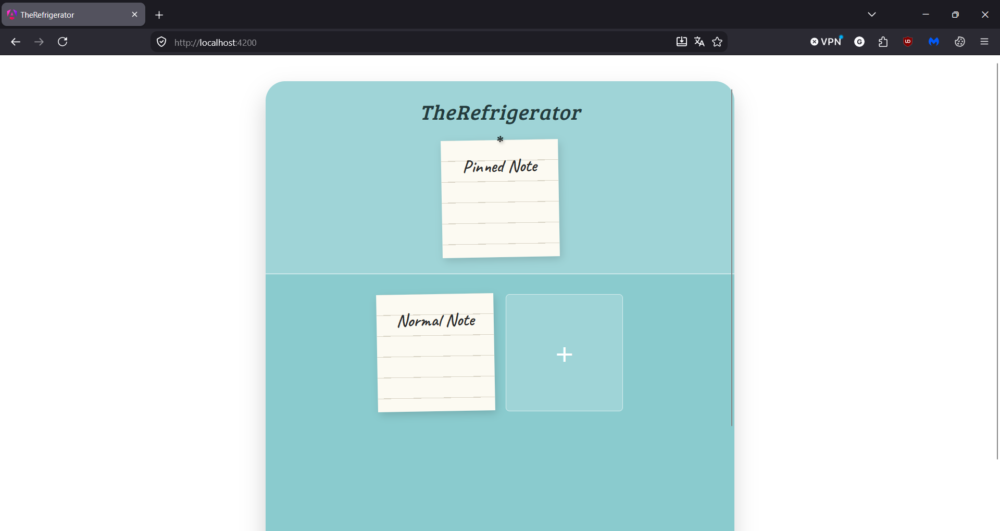
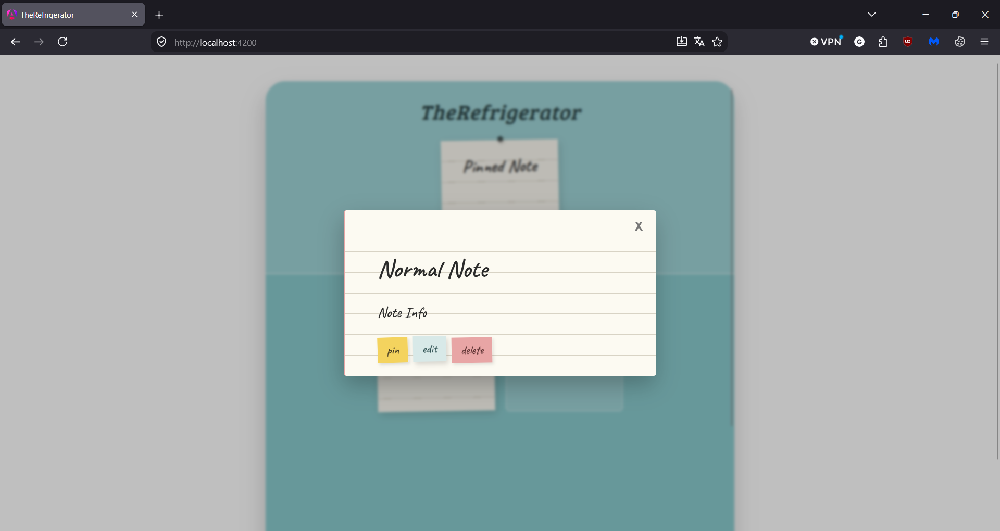
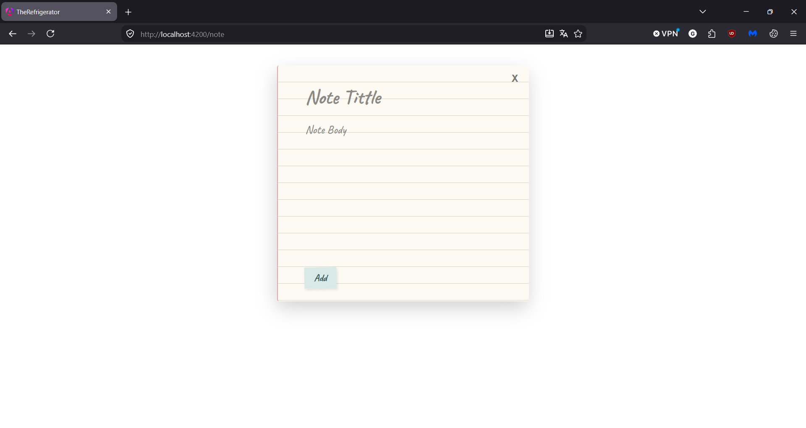

# The Refrigerator  
Aplicación web de bloc de notas con interfaz temática inspirada en un refrigerador. 

## Tecnologías
 - Frontend: Angular (TypeScript, HTML, CSS).
 - Backend: ASP.NET Core, C#, Entity Framework, SQL Server.
 - Autenticacion: JWT

 ## v1.0
 - Crear Notes.
 - Fijar Notas.
 - Editar Notas.
 - Eliminar Notas.
 - Guardar Notas utilizando localStorage.
 - Visualizar notas dentro de una interfaz con tematica de refrigerador.

 ## Vista Previa

 
 
 

 ## Próximamente
  - Conexión Angular + .NET.
  - Persistencia de datos en BD.
  - Registro de Usuarios.
  - Rediseño completo de interfaz.
  - Interacciones.
